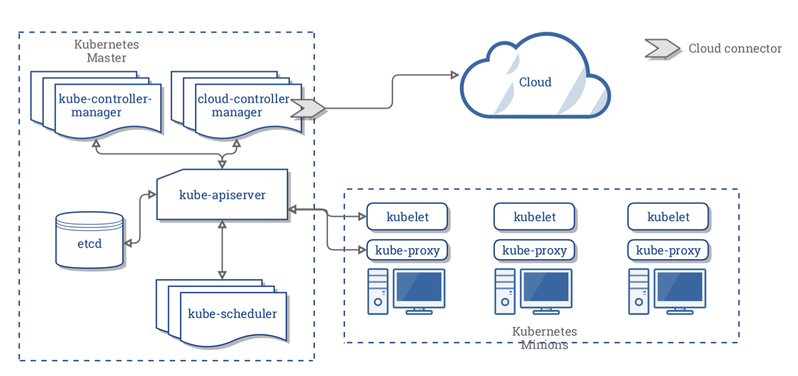

# Basics of Kubernetes

- [Basics of Kubernetes](#basics-of-kubernetes)
  - [Introduction](#introduction)
  - [Kubernetes Architecture](#kubernetes-architecture)
  - [Terminology](#terminology)
  - [Tools](#tools)

---

## Introduction

- Kubernetes is an orchestration system to deploy and manage containers.
- Developed and used by Google internally in the past

 

---

## Kubernetes Architecture

Reference: 
[Concepts Underlying the Cloud Controller Manager](https://kubernetes.io/docs/concepts/architecture/cloud-controller/)

Here is a high-level architecture diagram of the main system components of Kubernetes.

  

- Every node running a container have **kubelet** and **kube-proxy**
- In its simplest form, Kubernetes is made of a **central manager** (aka **master**) and some **worker** node (**minions**)

- Manager
  - API server
  - Scheduler
  - Controllers
  - Stoage system (stores sttate of the cluster, container settings and network configuration)

- Kubernetes exposes an API via the **API server**.
  - You can communicate with the API using a local client called `kubectl` or you can write your own client and use `curl` commands.
  - Using an API-based communication scheme allows for non-Linux worker nodes and containers. Support for Windows Server 2019 was graduated to Stable with the 1.14 release. 
  - Only Linux nodes can be master on a cluster.

- The **kube-scheduler** is forwarded the requests for running containers coming to the API and finds a suitable node to run that container.

- Each worker node in the cluster runs two processes: a **kubelet** and **kube-proxy**.
  - **kubelet**: receives requests to run the containers, manages any necessary resources and watches over them on the local node. The kubelet interacts with the local container engine, which is Docker by default, but could be `rkt` or `cri-o`, which is growing in popularity. 
  - **kube-proxy**: creates and manages networking rules to expose the container on the network.

 

---

## Terminology

**Pod**

- A **Pod** consists of one or more containers which share an IP address, access to storage and namespace. 
- Typically, one container in a Pod runs an application, while other containers support the primary application.

 

**Namespaces**

- Kubernetes uses **namespaces** to keep objects distinct from each other, for resource control and multi-tenant considerations. 
- Some objects are cluster-scoped, others are scoped to one namespace at a time. 
- As the namespace is a segregation of resources, pods would need to leverage services to communicate.

 

**Controllers & Operators**

- Orchestration is managed through a series of watch-loops (also called **controllers** / **operators**)
- Each controller interrogates the **kube-apiserver** for a particular object state, then modifying the object until the declared state matches the current state.
- These controllers are compiled into the kube-controller-manager, but others can be added using custom resource definitions.

 

**Operator - Deployment**

- The default and feature-filled operator for containers is a **Deployment**. 
- A Deployment does not directly work with pods. 
- Instead it manages **ReplicaSets**. 

 

**Operator - ReplicaSet**
- The **ReplicaSet** is an operator which will create or terminate pods by sending out a **podSpec**. 
- The podSpec is sent to the kubelet, which then interacts with the container engine, Docker by default, to spawn or terminate a container until the requested number is running.

 

- The service operator requests existing IP addresses and endpoints and will manage the network connectivity based on labels. 
- These are used to communicate between pods, namespaces, and outside the cluster. 
- There are also Jobs and CronJobs to handle single or recurring tasks, among others.

 

- To easily manage thousands of Pods across hundreds of nodes can be a difficult task. 
- To make management easier, we can use **labels**, arbitrary strings which become part of the object metadata. 
- These can then be used when checking or changing the state of objects without having to know individual names or UIDs. 
- Nodes can have **taints** to discourage Pod assignments, unless the Pod has a **toleration** in its metadata.
- There is also space in metadata for **annotations** which remain with the object but cannot be used by Kubernetes commands. This information could be used by third-party agents or other tools.

 

---

## Tools

- There are several tools you can use to work with Kubernetes.
- `Minikube` is a very simple tool meant to run inside of VirtualBox. If you have limited resources and do not want much hassle, it is the easiest way to get up and running. 

- Our labs will focus on the use of `kubeadm` and `kubectl`, which are very powerful and complex tools.
- There are third-party tools as well, such as `Helm`, an easy tool for using Kubernetes charts, and `Kompose` to translate Docker Compose files into Kubernetes objects. 
- Expect these tools to change often!

 

---