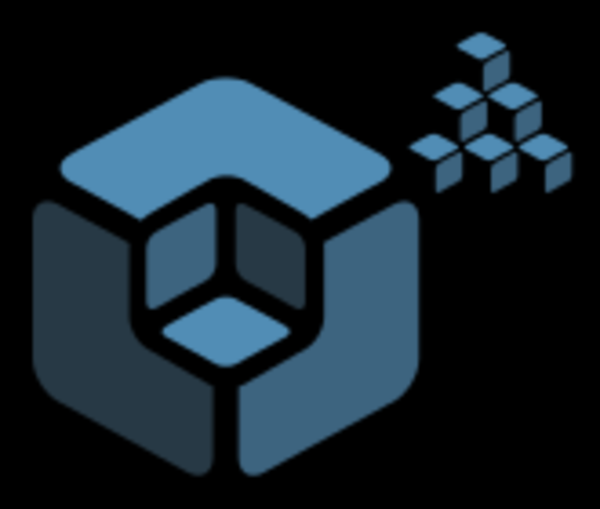
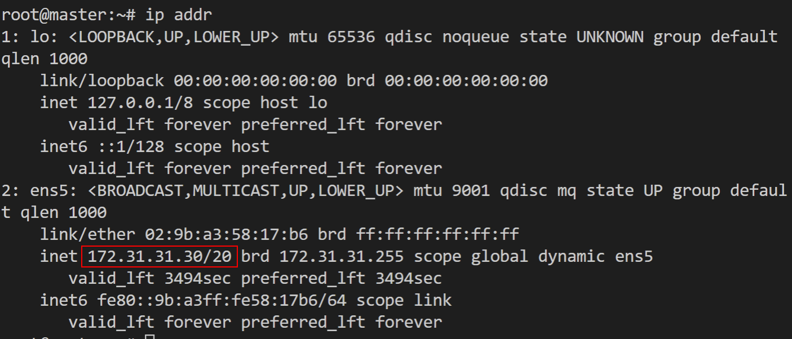
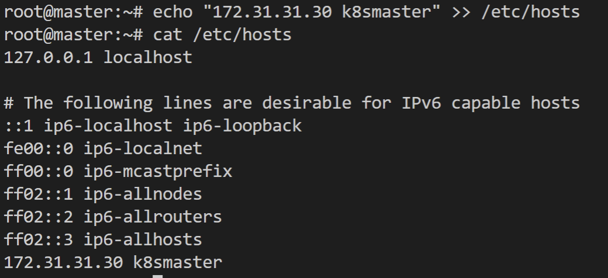
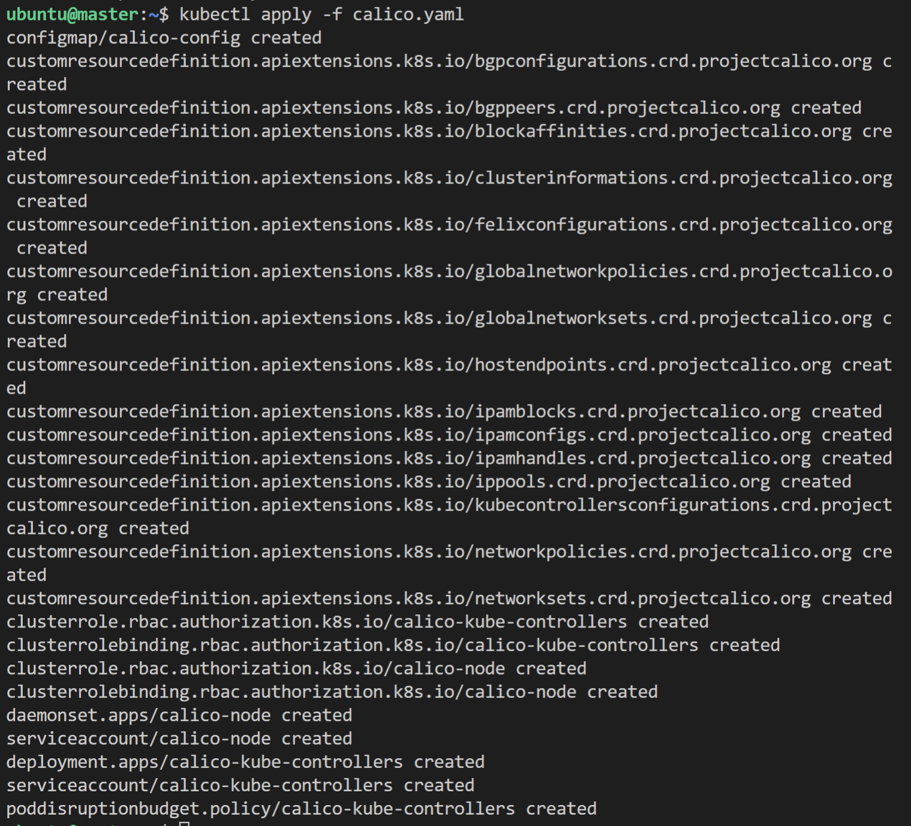

# Installation and Configuration

- [Installation and Configuration](#installation-and-configuration)
  - [Installation Tools](#installation-tools)
  - [Installing kubectl](#installing-kubectl)
  - [Using Google Kubernetes Engine (GKE)](#using-google-kubernetes-engine-gke)
  - [Using Minikube](#using-minikube)
  - [Installing with kubeadm](#installing-with-kubeadm)
  - [kubeadm-upgrade](#kubeadm-upgrade)
  - [Installing a Pod Network](#installing-a-pod-network)
  - [More installation tools](#more-installation-tools)
  - [Installation Considerations](#installation-considerations)
  - [Main Deployment Configurations](#main-deployment-configurations)
  - [systemd Unit File for Kubernetes](#systemd-unit-file-for-kubernetes)
  - [Using Hyperkube](#using-hyperkube)
  - [Compiling from Source](#compiling-from-source)
  - [Lab 3.1 - Install Kubernetes](#lab-31---install-kubernetes)

---

## Installation Tools

To get started without having to dive right away into installing and configuring a cluster, there are some choices. 

1. **Google Container Engine (GKE)**
2. **Minikube**: It is a single binary which deploys into the Oracle VirtualBox software, which can run in several operating systems. While Minikube is local and single node, it will give you a learning, testing, and development platform.
3. **MicroK8S**: A newer tool tool developed by Canonical, and aimed at easy installation. Aimed at appliance-like installations, it currently runs on Ubuntu 16.04 and 18.04. 

<br/>

- To be able to use the Kubernetes cluster, you will need to have installed the Kubernetes command line, called `kubectl`. 
- This runs locally on your machine and targets the API server endpoint. 
- It allows you to create, manage, and delete all Kubernetes resources (e.g. Pods, Deployments, Services). 
- It is a powerful CLI that we will use throughout the rest of this course. So, **you should become familiar with it**. 

<br/>

- We will use `kubeadm`, the community-suggested tool from the Kubernetes project, that makes installing Kubernetes easy and avoids vendor-specific installers. 
- Getting a cluster running involves two commands: 
  - `kubeadm init` that you run on one Master node, and then, 
  - `kubeadm join`, that you run on your worker or redundant master nodes, and your cluster bootstraps itself. 
- The flexibility of these tools allows Kubernetes to be deployed in a number of places.

```
kubeadm init
kubeadm join
```

<br/>

- We will also talk about other installation mechanisms, such as `kubespray` or `kops`, another way to create a Kubernetes cluster on AWS. 
- We will note you can create your systemd unit file in a very traditional way. 
- Additionally, you can use a container image called `hyperkube`, which contains all the key Kubernetes binaries, so that you can run a Kubernetes cluster by just starting a few containers on your nodes.

<br/>

---

## Installing kubectl

- To configure and manage your cluster, you will probably use the `kubectl` command. You can use RESTful calls or the Go language, as well. 
- Enterprise Linux distributions have the various Kubernetes utilities and other files available in their repositories. 
  - For example, on RHEL 7/CentOS 7, you would find `kubectl` in the kubernetes-client package. 
- You can (if needed) download the code from [GitHub](https://github.com/kubernetes/kubernetes/tree/master/pkg/kubectl), and go through the usual steps to compile and install kubectl.
- This command line will use `$HOME/.kube/config` as a configuration file. This contains all the Kubernetes endpoints that you might use. If you examine it, you will see cluster definitions (i.e. IP endpoints), credentials, and contexts. 
- A **context** is a combination of a cluster and user credentials. You can pass these parameters on the command line, or switch the shell between contexts with a command, as in: 

```
$ kubectl config use-context foobar
```

- This is handy when going from a local environment to a cluster in the cloud, or from one cluster to another, such as from development to production.

<br/>

---

## Using Google Kubernetes Engine (GKE)

Google takes every Kubernetes release through rigorous testing and makes it available via its GKE service. To be able to use GKE, you will need the following:

1. Google Cloud account
2. Payment method setup
3. `gcloud` command line client

<br/>

There is an extensive documentation to get it installed. Pick your favorite installation method and set it up. For more details, you can visit the [Installing Cloud SDK web page](https://cloud.google.com/sdk/install#linux).

<br/>

You will then be able to follow the [GKE quickstart guide](https://cloud.google.com/kubernetes-engine/docs/quickstart) and you will be ready to create your first Kubernetes cluster:

```
$ gcloud container clusters create linuxfoundation

$ gcloud container clusters list

$ kubectl get nodes
```

<br/>

By installing gcloud, you will have automatically installed `kubectl`. In the commands above, we created the cluster, listed it, and then, listed the nodes of the cluster with `kubectl`.

Once you are done, **do not forget to delete your cluster**; otherwise you will keep on getting charged for it:

```
$ gcloud container clusters delete linuxfoundation
```

<br/>

---

## Using Minikube

You can also use `Minikube`, an open source project within the [GitHub Kubernetes organization](https://github.com/kubernetes/minikube). 

While you can download a release from GitHub, following listed directions, it may be easier to download a pre-compiled binary. Make sure to verify and get the latest version. 

For example, to get the v.0.22.2 version, do:

```
$ curl -Lo minikube https://storage.googleapis.com/minikube/releases/latest/minikube-darwin-amd64

$ chmod +x minikube

$ sudo mv minikube /usr/local/bin
```

<br/>

With Minikube now installed, starting Kubernetes on your local machine is very easy:

```
$ minikube start

$ kubectl get nodes
```

<br/>

This will start a VirtualBox virtual machine that will contain a single node Kubernetes deployment and the Docker engine. 

Internally, `minikube` runs a single Go binary called `localkube`. This binary runs all the components of Kubernetes together. This makes Minikube simpler than a full Kubernetes deployment. 

In addition, the Minikube VM also runs Docker, in order to be able to run containers.

<br/>

---

## Installing with kubeadm

Once you become familiar with Kubernetes using Minikube, you may want to start building a real cluster. 

Currently, the most straightforward method is to use `kubeadm`, which appeared in Kubernetes v1.4.0, and can be used to bootstrap a cluster quickly. As the community has focused on kubeadm, it has moved from beta to stable and added high availability with v1.15.0.

<br/>

The Kubernetes website provides documentation on [how to use kubeadm to create a cluster](https://kubernetes.io/docs/setup/production-environment/tools/kubeadm/create-cluster-kubeadm/).

<br/>

Package repositories are available for Ubuntu 18.04 and CentOS 7.1. Packages have not yet been made available for Ubuntu 18.04, but will work as you will see in the lab exercises.

<br/>

To join other nodes to the cluster, you will need at least one token and an SHA256 hash. 

This information is returned by the command `kubeadm init`. Once the master has initialized, you would apply a network plugin. Main steps:

1. Run `kubeadm init` on the head node
2. Create a network for IP-per-Pod criteria
3. Run `kubeadm join --token <token> <head-node-IP>` on worker nodes.

<br/>

You can also create the network with kubectl by using a resource manifest of the network.

For example, to use the Weave network, you would do the following: 

```
$ kubectl create -f https://git.io/weave-kube 
```

Once all the steps are completed, workers and other master nodes joined, you will have a functional multi-node Kubernetes cluster, and you will be able to use `kubectl` to interact with it.

<br/>

---

## kubeadm-upgrade

- If you build your cluster with `kubeadm`, you also have the option to upgrade the cluster using the `kubeadm upgrade` command. 
- While most choose to remain with a version for as long as possible, and will often skip several releases, this does offer a useful path to regular upgrades for security reasons.

<br/>

- `plan`: This will check the installed version against the newest found in the repository, and verify if the cluster can be upgraded.
- `apply`: Upgrades the first control plane node of the cluster to the specified version.
- `diff`: Similar to an `apply --dry-run`, this command will show the differences applied during an upgrade.
- `node`: This allows for updating the local kubelet configuration on worker nodes, or the control planes of other master nodes if there is more than one. Also, it will access a `phase` command to step through the upgrade process.

<br/>

General upgrade process:

1. Update the software
2. Check the software version
3. Drain the control plane
4. View the planned upgrade
5. Apply the upgrade
6. Uncordon the control plane to allow pods to be scheduled.

<br/>

Reference:<br/>
https://kubernetes.io/docs/tasks/administer-cluster/kubeadm/kubeadm-upgrade/

<br/>

---

## Installing a Pod Network

- Prior to initializing the Kubernetes cluster, the network must be considered and IP conflicts avoided. 
- There are several Pod networking choices, in varying levels of **development** and **feature set**.
- Many of the projects will mention the **Container Network Interface (CNI)**, which is a CNCF project. 
- Several container runtimes currently use CNI. 
- As a standard to handle deployment management and cleanup of network resources, CNI will become more popular.

<br/>

| Pod Networking | Name | Description |
| ---- | --- | --- |
|  | Calico | A flat Layer 3 network which communicates without IP encapsulation, used in production with software such as Kubernetes, OpenShift, Docker, Mesos and OpenStack. Viewed as a simple and flexible networking model, it scales well for large environments. Another network option, Canal, also part of this project, allows for integration with Flannel. Allows for implementation of network policies.<br/><br/>Reference:<br/>https://www.projectcalico.org/ |
|  | Flannel | A Layer 3 IPv4 network between the nodes of a cluster. Developed by CoreOS, it has a long history with Kubernetes. Focused on traffic between hosts, not how containers configure local networking, it can use one of several backend mechanisms, such as VXLAN. A flanneld agent on each node allocates subnet leases for the host. While it can be configured after deployment, it is much easier prior to any Pods being added.<br/><br/>Reference:<br/>https://github.com/coreos/flannel |
|  | Kube-Router | Feature-filled single binary which claims to "do it all". The project is in the alpha stage, but promises to offer a distributed load balancer, firewall, and router purposely built for Kubernetes.<br/><br/>Reference:<br/>https://www.kube-router.io/
|  | Romana | This is another project aimed at network and security automation for cloud native applications. Aimed at large clusters, IPAM-aware topology and integration with kops clusters.<br/><br/>Reference:<br/>https://github.com/romana/romana |
|  | Weave Net | It is typically used as an add-on for a CNI-enabled Kubernetes cluster.<br/><br/>Reference:<br/>https://www.weave.works/oss/net/ |

<br/>

---

## More installation tools

- Since Kubernetes is, after all, like any other applications that you install on a server (whether physical or virtual), all of the configuration management systems (e.g., Chef, Puppet, Ansible, Terraform) can be used. 
- Various recipes are available on the Internet.
- The best way to learn how to install Kubernetes using step-by-step manual commands is to examine the [Kelsey Hightower walkthrough](https://github.com/kelseyhightower/kubernetes-the-hard-way).

<br/>

Examples of installation tools:

| Tool | Name | Description |
| --- | --- | --- |
|  | kubespray | `kubespray` is now in the Kubernetes incubator. It is an advanced **Ansible playbook** which allows you to set up a Kubernetes cluster on various operating systems and use different network providers. ​It was once known as kargo.<br/><br/>Reference:<br/>https://github.com/kubernetes-sigs/kubespray |
|  | kops | kops (Kubernetes Operations) lets you create a Kubernetes cluster on AWS via a single command line. Also in beta for GKE and alpha for VMware.<br/><br/>Reference:<br/>https://github.com/kubernetes/kops |
| {:height="25%" width="25%"} | kube-aws | `kube-aws` is a command line tool that makes use of the AWS Cloud Formation to provision a Kubernetes cluster on AWS.<br/><br/>Reference:<br/>https://kubernetes-incubator.github.io/kube-aws/ |
|  | kubicorn | `kubicorn` is a tool which leverages the use of `kubeadm` to build a cluster. It claims to have no dependency on DNS, runs on several operating systems, and uses snapshots to capture a cluster and move it.<br/><br/>Reference:<br/>http://kubicorn.io/ |

<br/>

## Installation Considerations

- To begin the installation process, you should start experimenting with a single-node deployment. 
- This single-node will run all the Kubernetes components (e.g. API server, controller, scheduler, kubelet, and kube-proxy). You can do this with `Minikube` for example.

<br/>

- Once you want to deploy on a cluster of servers (physical or virtual), you will have many choices to make, just like with any other distributed system:

1. Which provider should I use? A public or private cloud? Physical or virtual?

2. Which operating system should I use? Kubernetes runs on most operating systems (e.g. Debian, Ubuntu, CentOS, etc.), plus on container-optimized OSes (e.g. CoreOS, Atomic).

3. Which networking solution should I use? Do I need an overlay?

4. Where should I run my etcd cluster?

5. Can I configure Highly Available (HA) head nodes?

<br/>

To learn more about how to choose the best options, you can read the [Getting Started](https://kubernetes.io/docs/setup/) documentation page.

<br/>

- With `systemd` becoming the dominant init system on Linux, your Kubernetes components will end up being run as systemd unit files in most cases. Or, they will be run via a `kubelet` running on the head node (i.e. `kubadm`).

<br/>

---

## Main Deployment Configurations

At a high level, you have four main deployment configurations:

**Single-node**
- With a single-node deployment, all the components run on the same server. 
- This is great for testing, learning, and developing around Kubernetes.

<br/>

**Single head node, multiple workers**
- Adding more workers, a single head node and multiple workers typically will consist of a single node etcd instance running on the head node with the API, the scheduler, and the controller-manager.

<br/>

**Multiple head nodes with HA, multiple workers**
- Multiple head nodes in an HA configuration and multiple workers add more durability to the cluster. 
- The API server will be fronted by a load balancer, the scheduler and the controller-manager will elect a leader (which is configured via flags). 
- The etcd setup can still be single node.

<br/>

**HA etcd, HA head nodes, multiple workers**
- The most advanced and resilient setup would be an HA etcd cluster, with HA head nodes and multiple workers. 
- Also, etcd would run as a true cluster, which would provide HA and would run on nodes separate from the Kubernetes head nodes.

<br/>

- Which of the four you will use will depend on how advanced you are in your Kubernetes journey, but also on what your goals are.
- The use of Kubernetes Federation also offers high availability. 
- Multiple clusters are joined together with a common control plane allowing movement of resources from one cluster to another administratively or after failure.​ 
- While Federation has has some issues, there is hope v2 will be a stronger product. 

<br/>

---

## systemd Unit File for Kubernetes

- In any of these configurations, you will run some of the components as a standard system daemon. 
- As an example, you can see here a sample systemd unit file to run the controller-manager. 
- Using `kubeadm` will create a system daemon for kubelet, while the rest will deploy as containers:

```
 - name: kube-controller-manager.service
    command: start 
    content: |
      [Unit]
      Description=Kubernetes Controller Manager Documentation=https://github.com/kubernetes/kubernetes
      Requires=kube-apiserver.service
      After=kube-apiserver.service
      [Service]
      ExecStartPre=/usr/bin/curl -L -o /opt/bin/kube-controller-manager -z /opt/bin/kube-controller-manager https://storage.googleapis.com/kubernetes-release/release/v1.7.6/bin/linux/amd64/kube-controller-manager
      ExecStartPre=/usr/bin/chmod +x /opt/bin/kube-controller-manager
      ExecStart=/opt/bin/kube-controller-manager \
        --service-account-private-key-file=/opt/bin/kube-serviceaccount.key \
        --root-ca-file=/var/run/kubernetes/apiserver.crt \
        --master=127.0.0.1:8080 \

...
```

- This is by no means a perfect unit file. 
- It downloads the controller binary from the published release of Kubernetes and sets a few flags to run.

- As you dive deeper in the configuration of each component, you will become more familiar not only with its configuration, but also with the various existing options, including those for authentication, authorization, HA, container runtime, etc. Expect them to change.

- For example, the API server is highly configurable. 
- The Kubernetes documentation provides more details about the kube-apiserver.

<br/>

---

## Using Hyperkube

- While you can run all the components as regular system daemons in unit files, you can also run the API server, the scheduler, and the controller-manager as containers. This is what `kubeadm` does.

<br/>

- Similar to `minikube`, there is a handy all-in-one binary named `hyperkube`, which is available as a **container image** (e.g. gcr.io/google_containers/hyperkube:v1.16.7). 
- This is hosted by Google, so you may need to add a new repository so Docker would know where to pull the file. 
- Updated and changes to sub-commands are ongoing. 
- Reference the help of the current version for more information. You can find the current release of software here: https://console.cloud.google.com/gcr/images/google-containers/GLOBAL/hyperkube.

<br/>

- This method of installation consists in running a kubelet as a system daemon and configuring it to read in manifests that specify how to run the other components (i.e. the API server, the scheduler, etcd, the controller). 
- In these manifests, the hyperkube image is used. 
- The kubelet will watch over them and make sure they get restarted if they die.

<br/>

To get a feel for this, you can simply download the `hyperkube` image and run a container to get help usage:

```
$ docker run --rm gcr.io/google_containers/hyperkube:v1.16.7 /hyperkube kube-apiserver --help

$ docker run --rm gcr.io/google_containers/hyperkube:v1.16.7 /hyperkube kube-scheduler --help

$ docker run --rm gcr.io/google_containers/hyperkube:v1.16.7 /hyperkube kube-controller-manager --help
```

<br/>

This is also a very good way to start learning the various configuration flags.

<br/>

---

## Compiling from Source

- The [list of binary releases](https://github.com/kubernetes/kubernetes/releases) is available on GitHub. 
- Together with gcloud, minikube, and kubeadmin, these cover several scenarios to get started with Kubernetes.

<br/>

- Kubernetes can also be compiled from source relatively quickly. 
- You can clone the repository from GitHub, and then use the `Makefile` to build the binaries. You can build them natively on your platform if you have a Golang environment properly set up, or via Docker containers if you are on a Docker host.
- To build natively with Golang, first [install Golang](https://golang.org/doc/install). Download files and directions can be found online.

<br/>

Once Golang is working, you can clone the `kubernetes` repository, around 500MB in size. Change into the directory and use make:

```
$ cd $GOPATH

$ git clone https://github.com/kubernetes/kubernetes

$ cd kubernetes

$ make
```

<br/>

- On a Docker host, clone the repository anywhere you want and use the make quick-release command. 
- The build will be done in Docker containers. 
- The `_output/bin` directory will contain the newly built binaries.
- You may find some materials via GitLab, but most resources are on GitHub at the moment.

<br/>

---

## Lab 3.1 - Install Kubernetes

1. Login to the first node

```
ssh -i <private-key> ubuntu@<ip>
```

<br/>

2. Become `root` and upgrade the system.

```
$ sudo -i

# apt update -y && apt upgrade -y
```

<br/>

3. Install Docker

```
# apt install -y docker.io 
```

<br/>

4. Add a new repo for kubernetes.

```
# cat > /etc/apt/sources.list.d/kubernetes.list << EOF
deb http://apt.kubernetes.io/ kubernetes-xenial main
EOF
```

<br/>

5. Add GPG key for the packages.

```
# curl -s https://packages.cloud.google.com/apt/doc/apt-key.gpg | apt-key add - 
```

<br/>

6. Install the software

```
# apt update -y && apt install -y kubeadm kubelet kubectl
```

You can also hold the version by using:

```
# apt-mark hold kubelet kubelet kubectl
```

<br/>

7. Deciding which pod network to use for Container Networking Interface (CNI) should take into account the expecteddemands on the cluster.  There can be only one pod network per cluster, although theCNI-Genieproject is trying tochange this. 

The network must allow container-to-container, pod-to-pod, pod-to-service, and external-to-service communications. As **Docker** uses host-private networking, using the `docker0` virtual bridge and `veth` interfaces would require being on that host to communicate.

We will use **Calico** as a network plugin which will allow us to use Network Policies later in the course. Currently Calico does not deploy using CNI by default. 

Newer versions of Calico have included RBAC in the main file. Once downloaded look for the expected IPV4 range for containers to use in the configuration file.

```
# wget https://docs.projectcalico.org/manifests/calico.yaml
```

<br/>

8. Use `less` to page through the file. Look for the IPV4 pool assigned to the containers. There are many different configuration settings in this file. Take a moment to view the entire file. The `CALICO_IPV4POOL_CIDR` must match the value given to `kubeadm init` in the following step, whatever the value may be. Avoid conflicts with existing IP ranges of the instance.

```
cat calico.yaml | grep CALICO_IPV4POOL -B 1
```

<br/>

9. Find the IP address of the primary interface of the master server. 

```
ip addr
```

  

<br/>

10. Add a local DNS alias for our master server. Edit `/etc/hosts` and add the IP address found using `ip addr`

```
echo "172.31.31.30 k8smaster" >> /etc/hosts
```

  

<br/>

11. Create a configuration file for the cluster. There are many options we could include, but will only set the control plane endpoint, software version to deploy and podSubnet values. After our cluster is initialized we will view other default values used. Be sure to use the node alias, not the IP so the network certificates will continue to work when we deploy a load balancer in a future lab.

```
cat > kubeadm-config.yaml << EOL
apiVersion: kubeadm.k8s.io/v1beta2
kind: ClusterConfiguration
kubernetesVersion: stable
controlPlaneEndpoint: "k8smaster:6443"
networking:
  podSubnet: 192.168.0.0/16  # range found in calico.yaml
EOL
```

<br/>

12. Initialize the master. Read through the output line by line. Expect the output to change as the software matures. At the end are configuration directions to run as a non-root user. The token is mentioned as well. This information can be found later with the `kubeadm token list` command. 

  The output also directs you to create a pod network to the cluster, which will be our next step. Pass the network settings Calico has in its configuration file, found in the previous step. 

  Please note: the output lists several commands which following exercise steps will complete.

```
kubeadm init --config=kubeadm-config.yaml --upload-certs | tee kubeadm-init.out
```

Output:

```
You can now join any number of the control-plane node running the following command on each as 
root:

  kubeadm join k8smaster:6443 --token zxar4b.et4kwksqv2bgue0j \
    --discovery-token-ca-cert-hash sha256:197ae9ef1862bea2eb61edfc1ad29b59f9e4f3a795cba3382c068a6bba15b9ab \
    --control-plane --certificate-key 0fb387c6b9cf8b985ce1a8fd1e80855a94209910b9beb7cadf1e9273902add81

Please note that the certificate-key gives access to cluster sensitive data, keep it secret!   
As a safeguard, uploaded-certs will be deleted in two hours; If necessary, you can use
"kubeadm init phase upload-certs --upload-certs" to reload certs afterward.

Then you can join any number of worker nodes by running the following on each as root:

kubeadm join k8smaster:6443 --token zxar4b.et4kwksqv2bgue0j \
    --discovery-token-ca-cert-hash sha256:197ae9ef1862bea2eb61edfc1ad29b59f9e4f3a795cba3382c068a6bba15b9ab
```

<br/>

13. As suggested in the directions at the end of the previous output we will allow a non-root user admin level access to the cluster. Take a quick look at the configuration file once it has been copied and the permissions fixed.

```
# exit
$ mkdir -p $HOME/.kube
$ sudo cp -i /etc/kubernetes/admin.conf $HOME/.kube/config
$ sudo chown $(id -u):$(id -g) $HOME/.kube/config
$ cat .kube/config
```

<br/>

14. Apply the network plugin configuration to your cluster. Remember to copy the file to the current, non-root user directory first.

```
sudo cp /root/calico.yaml .
kubectl apply -f calico.yaml
```

  

<br/>

15. While many objects have short names, a `kubectl` command can be a lot to type. We will enable bash auto-completion. Begin by adding the settings to the current shell. Then update the `$HOME/.bashrc` file to make it persistent. Ensure the bash-completion package is installed. If it was not installed, log out then back in for the shell completion to work.

```
sudo apt install -y bash-completion
source <(kubectl completion bash)
echo "source <(kubectl completion bash)" >> $HOME/.bashrc
```

<br/>
16. Test by describing the node again. 
  Type the first three letters of the sub-command then type the Tab key. 
  
  Auto-completion assumes the default namespace. Pass the namespace first to use auto-completion with a different namespace. By pressing Tab multiple times you will see a list of possible values. 
  
  Continue typing until a unique name is used. First look at the current node (your node name may not start with lfs458-), then look at pods in the `kube-system` namespace. 
  
  If you see an error instead such as `-bash: _get_comp_words_by_ref:` command not found revisit the previous step, install the software, log out and back in.

```
kubectl des<Tab> n<Tab><Tab>
kubectl -n kube-s<Tab> g<Tab> po<Tab>
```

<br/>

17. View other values we could have included in the `kubeadm-config.yaml` file when creating the cluster.

```
sudo kubeadm config print init-defaults
```